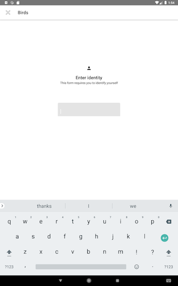

# Identify User

This prototype is based on [this spec](https://docs.google.com/document/d/1lVObIqvM75tCSA5w8Iu3WropJDQmpE3Cap3GWOepTOY). The prototype formats are:

* A [flow diagram](flow.png) to illustrate navigation and layout
* A printable [paper prototype](paper.pdf) of the screens involved in the flow
* A demo [APK](android.apk)

The thinking around the design and flow is mainly based on Material's [Full Screen Dialog](https://material.io/components/dialogs/#full-screen-dialog). The layout in the dialog is similar to that used by Android 10's full screen password prompts.
