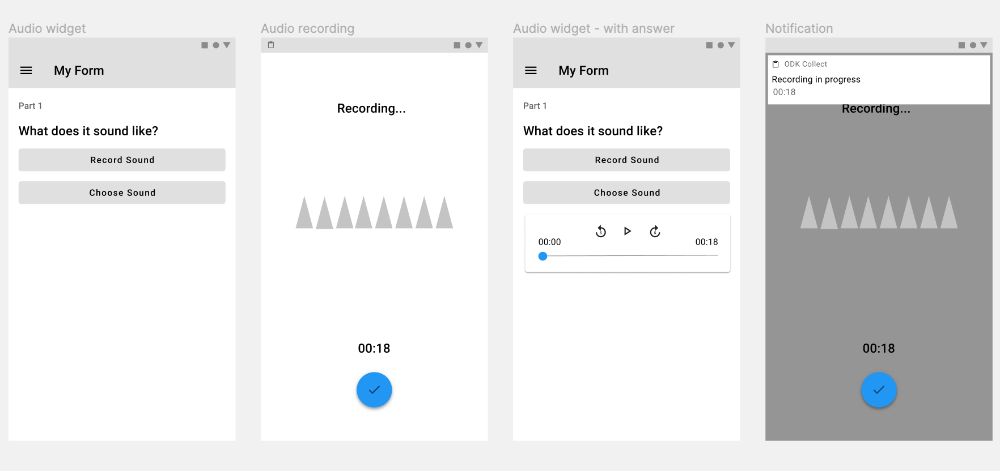

# In-app audio recording

Originally based on [this forum post](https://forum.getodk.org/t/adding-native-audio-recording-for-audio-type-questions/29347) which outlines and discusses the feature request.

This adds audio recording to Collect so that `audio` questions can be used without the need for a third party app.

The flow for the new recording functionality and settings are prototyped [here](recording.fig).
