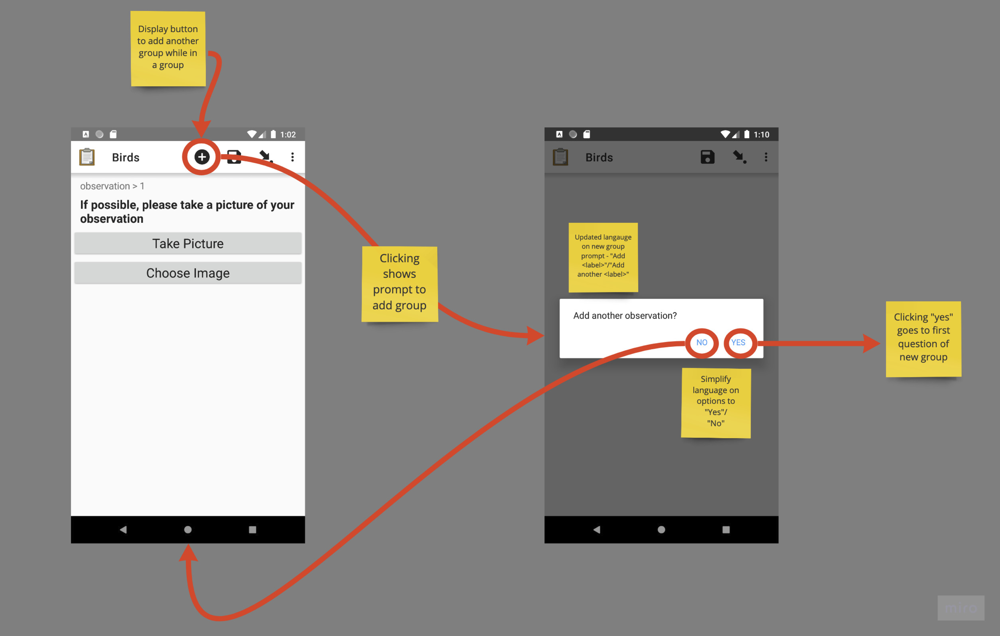

# Repeat Tweaks

This prototype adds changes motivated by [research into repeats](https://github.com/seadowg/collect-design/blob/master/research/repeats.md).

The thinking around the design was to use Material's [Contextual Action Bar](https://material.io/components/app-bars-top/#contextual-action-bar) to add an easier/faster way for enumerators to add repeat groups while filling out forms. A [FAB](https://material.io/components/buttons-floating-action-button/) was considered but felt wrong as generally a FAB should only be used for a screens "primary" action.

For the dialog the design has simply been updated to match the Material [Alert Dialog](https://material.io/components/dialogs/#alert-dialog) and has had the language altered so there is more emphasis on the repeat group's label and no mention of "group".
