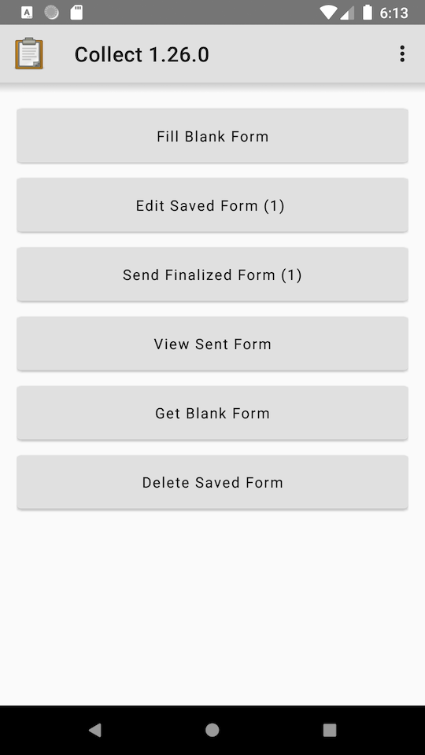

# Revised Main Menu

This is motivated by the addition of Material Banners (for some features) to the Main Menu which will mean pushing the content down. The idea here was to look at removing unnecessary elements: the app "title" has been moved to the Toolbar and the tagline is now gone. There is a lot of changes we could make in terms of navigation here (going straight to forms, menu drawer, tabs etc) but it feels like any bigger changes will need research and testing.

The buttons on the Main Menu have also been changed to [Material Buttons](https://material.io/components/buttons/) and the primary color for the app has been changed to a grey (#E0E0E0) so the buttons don't end up being the same color as the background. This is also reflected on the Toolbar. The buttons have extra top/bottom padding to ~~keep them chunky~~ make sure they occupy roughly the same amount of space as the old ones.

The Material Buttons aren't use the "all caps" style as suggested in the spec. This was based on data around all caps being less accessible.

We'd eventually want to change the primary color to be something nicer but this lets us take the visual changes one step at a time.
