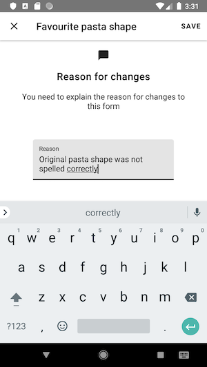

# Track Changes Reason

This prototype is based on [this spec](https://docs.google.com/document/d/1NyBFhASCOAqOSmz70diQObKpymVE59_MuwjOUPCKlR8). The prototype formats are:

* A demo [APK](android.apk)

The thinking around the design and flow is mainly based on Material's [Full Screen Dialog](https://material.io/components/dialogs/#full-screen-dialog).
